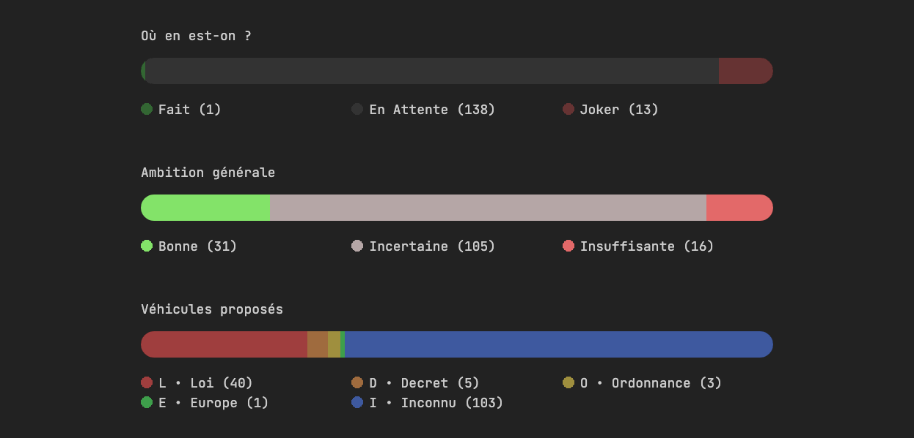
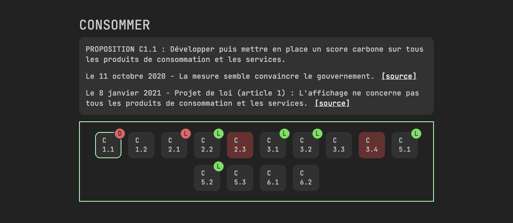

# 149 propositions

Code source du site [149propositions.fr](https://www.149propositions.fr).

Le but de ce projet est d'effectuer un contrôle citoyen de l'[engagement](https://youtu.be/m0F-uslFshA?t=557) du président de la République : reprendre 146 des 149 propositions de la Convention Citoyenne pour le Climat.

# Contribuer

Toutes les contributions sont les bienvenues.

- Si vous voulez compléter le site, vous pouvez  [envoyer un mail](mailto:yopoxdev+149@gmail.com), ou bien [ouvrir un ticket](https://github.com/yopox/149-propositions/issues/new?assignees=&labels=actualit%C3%A9&template=nouvelle-actualit-.md&title=).
- Pour des modifications plus conséquentes, clonez le projet et effectuez une fusiodemande (PR).